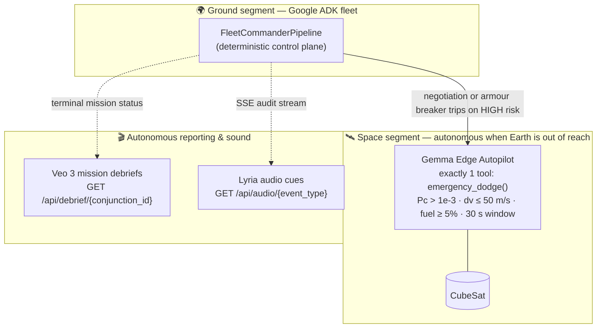

# Project O.R.B.I.T.

**Orchestrated Routing & Ballistic Incident Tracking**

*Fortified Enterprise Fleet Track — All Things Agentic Hackathon 2026*

[](LICENSE)


---

## 🎯 The Problem: Kessler Syndrome

Space debris moves at **17,000 mph** (≈ 7.6 km/s in low Earth orbit). A single
collision creates thousands of fragments, each becoming a new projectile in a
self-sustaining cascade — the Kessler Syndrome.

University CubeSat programs and small satellite operators bear exactly the same
collision-avoidance responsibilities as NASA-sized control rooms, with none of
the staffing:

> Conjunction screening requires interpreting messy Two-Line Element sets,
> running SGP4 propagations, computing collision probabilities, negotiating
> with other operators over *who* moves, and executing fuel-budgeted maneuvers
> — all under time pressure, around the clock.

---

## 🚀 The Solution: O.R.B.I.T.

A multi-agent fleet built on **Google ADK** that autonomously runs the entire
conjunction-response pipeline:

1. **Triages** messy inbound alerts into validated mission dossiers.
2. **Screens conjunctions** with real SGP4 propagation and a three-stage
   time-of-closest-approach refinement.
3. **Assesses collision probability** using Chan's first-order Gaussian method
   against NASA CARA / ESA risk bands.
4. **Negotiates dodge responsibility** with external constellation operators
   under fuel-budget diplomacy rules, with HMAC-SHA256 acknowledgements.
5. **Gates every maneuver twice**: an LLM Safety Officer verdict followed by a
   deterministic Model Armor sweep — hallucination guard, policy ceiling,
   strategic fuel reserve, secret/PII scan.
6. **Persists state** across sessions via a Firestore-backed memory bank, with
   every decision correlated by a mission-scoped trace ID on an OTel-style
   audit trail.

### Verified behaviour

| Check | Result |
|---|---|
| Calibrated HIGH-risk scenario (`LANCASTER_ORBIT_1` × `FENGYUN_1C_DEB`) | **89 m miss @ TCA, Pc = 7.51e-4 → HIGH** |
| Hallucination Guard | 13.9 m/s payload vs 10.0 m/s approved → REJECTED |
| Policy Ceiling | 80 m/s request vs 50 m/s ceiling → REJECTED |
| Strategic Fuel Reserve | burn projecting 2.75% < 5% reserve → REJECTED |
| Secret/PII sweep | planted AWS key + email caught by pattern label; content never echoed |
| End-to-end degraded mode (no LLM credentials) | triage breaker trips after 3 attempts → structured `HUMAN_DISPATCH_DEGRADED` + full audit replay |
| Edge autonomy wiring | `gemma_edge_autopilot` live in `/api/agent_tree` with its single `emergency_dodge` tool; ROM rule executes above Pc 1e-3, holds below it, caps an 80 m/s request to the 50 m/s ceiling and refuses fuel-reserve breaches |
| Edge autonomy end-to-end (no LLM reachable) | breaker trigger → `EDGE_AUTONOMY_ENGAGED` → `EDGE_LLM_UNAVAILABLE` → ROM verdict → `EDGE_AUTONOMOUS_DODGE_EXECUTED`, 12.0 m/s uplinked, Memory Bank fuel debited, debrief attached — every line tagged `EDGE_AUTONOMOUS` |
| Autonomous Veo debrief | terminal mission → debrief `READY` attached to the conjunction record; simulated reconstruction renders fully offline, honest about its mode |
| Lyria event cues | all 5 cue types served as valid 22.05 kHz mono WAV from `/api/audio/{event_type}` (0.32 s–1.70 s, 14–75 kB), memoised after first render; unknown types rejected with the available list |
| API surface | all endpoint smoke checks passing against real `google-adk` (including new `/api/debrief/{id}` and `/api/audio/{event_type}`) |

---

## 📊 Judging Criteria → Evidence Map

### Innovation & Operational Utility (40%)

| Criterion | Evidence |
|-----------|----------|
| "Unlikely Hero" outside standard corporate roles | University CubeSat mission controllers and small-operator teams — real people with NASA-sized responsibility and no control room |
| Complex enough to warrant multi-agent system | 4 specialists + 1 deterministic orchestrator, each with distinct tools, models and responsibilities |
| Intelligently delegate tasks | `FleetCommanderPipeline` branches on validated risk bands: LOW → log & close; MEDIUM → advisory review held for human-in-the-loop; HIGH → full negotiation + dual-gate execution |
| "Twist" — autonomous action over chat | HIGH-risk missions run end-to-end without a human: negotiate with external fleets, pass two independent safety gates, authorise uplink, persist fleet state — then hand back an auditable decision record |

### Architectural Discipline & Tech Stack (30%)

| Criterion | Evidence |
|-----------|----------|
| Strict separation of concerns | Each agent owns a scoped tool roster; the Safety Officer owns **zero** tools; the orchestrator owns zero tools and delegates everything |
| Zero-trust enforcement | `AgentRegistry` manifests are deny-by-default; boot-time attestation verifies every declared tool **plus five negative controls**, or the process refuses to start |
| Failure-tolerant routing | Circuit breakers: 3 attempts, 1 s/2 s/4 s exponential backoff, JSON-schema validation between attempts, persisted failure counters; tripped breakers degrade to `HUMAN_DISPATCH_DEGRADED` instead of guessing |
| Model Armor guardrails | 4 deterministic checks executed *after* the LLM verdict and *before* any persistence/uplink: hallucination guard, policy ceiling, fuel reserve, secret sweep |
| Observability | Every mission emits one `trace_id`; `AuditLogger` writes OTel-style JSON to stdout → Cloud Logging; `GET /api/armor_report/{trace_id}` replays the entire reasoning chain |

### Demo & Production Readiness (30%)

| Criterion | Evidence |
|-----------|----------|
| Live execution proof | Deploys to Cloud Run via `./deploy.sh`; `/api/conjunction_alert` returns structured mission outcomes |
| Architecture transparency | `GET /api/agent_tree` renders the live fleet hierarchy — models, tools, temperatures included |
| Reproducible setup | `requirements.txt`, `.env.example`, Dockerfile layer caching, idempotent deploy script |
| Google Cloud proof | Cloud Run service, Firestore collections (`satellites/`, `conjunctions/`), Cloud Logging audit lines with severity levels |

---

## 🛠️ Tech Stack

| Component | Technology |
|-----------|------------|
| AI Models | Gemini 2.5 Pro (alert triage), Gemini 2.5 Flash (astrodynamics + negotiation), Gemini 3.5 Flash default for safety verdicts (env-tunable), **Gemma 3 (onboard edge autonomy)** |
| Generative Media | **Veo 3** (autonomous mission-debrief video), **Lyria 2** (mission-control audio cues) |
| Agent Framework | Google Agent Development Kit (ADK) 2.7.1 |
| Orbital Mechanics | python-sgp4 propagation, three-stage TCA refinement, Chan's first-order Gaussian Pc |
| Cloud Infrastructure | Cloud Run, Firestore (async client), Cloud Logging |
| Command Center | React + Vite, CesiumJS globe, Server-Sent Events live feed |
| API Framework | FastAPI, Uvicorn |
| Security | Constant-time API-key middleware, zero-trust Agent Registry, dual-layer maneuver gating |
| Observability | Mission-scoped trace IDs, OTel-style structured JSON logging |

---

## 🎁 Additional AI Integrations

Three extra Google models give the fleet senses beyond Gemini reasoning:
an onboard brain for when Earth goes quiet, a documentarian for when the
mission ends, and a soundtrack for while it happens.



### 1. Gemma Edge Autopilot — `agents/edge_agent.py`

When a HIGH-risk conjunction is mid-flight and the ground pipeline cannot
finish (negotiation or armour circuit breaker trips), the mission hands over
to a satellite-side **Gemma** agent — the flight analogue of losing downlink
during an incident. It holds exactly one tool (`emergency_dodge`), one
30-second decision window, and stricter physics than Model Armor applies:
Pc must exceed 1e-3, the burn stays under the 50 m/s ceiling and never eats
into the 5% strategic fuel reserve. If inference itself is unavailable, a
hardcoded ROM rule decides instead — the spacecraft never waits for a model.
Every edge decision is audited with the **`EDGE_AUTONOMOUS`** tag, and the
feature is kill-switchable via `ORBIT_ENABLE_EDGE_AUTONOMY=0`.

### 2. Veo Mission Debriefs — `tools/debrief_generator.py`

The fleet doesn't just solve problems — it documents them. When a mission
terminates (`EXECUTION_AUTHORIZED`, `MANEUVER_BLOCKED`, or an autonomous
edge dodge), a background task renders a cinematic summary of the encounter,
generates a debrief video with **Veo 3**, and attaches it to the conjunction
record in Firestore. `GET /api/debrief/{conjunction_id}` serves generation
status plus the artifact, and the command center surfaces a MISSION DEBRIEF
button the moment a conjunction resolves.

### 3. Lyria Mission-Control Audio — `tools/audio_generator.py`

You can hear the fleet think. Each key event class owns a generated audio
identity — rising alert (`ALERT_DETECTED`), resolving chord
(`MANEUVER_AUTHORIZED`), low cautionary drone (`MANEUVER_BLOCKED`), urgent
triple-beep (`HUMAN_DISPATCH`) and an edge-autonomy chirp
(`EDGE_AUTONOMOUS`) — produced by **Lyria 2** and served as memoised WAV
from `GET /api/audio/{event_type}`. The MissionFeed plays the matching cue
as events stream in over SSE.

> **Honesty note:** Veo and Lyria calls are gated behind
> `ORBIT_ENABLE_REAL_VEO=1` / `ORBIT_ENABLE_REAL_LYRIA=1`. Without them (or
> without Vertex credentials) both integrations degrade to clearly-labelled
> deterministic simulations — an SVG reconstruction of the encounter and a
> procedural synth cue respectively — so the demo works anywhere and never
> pretends a mock is a real render.

---

## 🚀 Quick Start

### Prerequisites

- Python 3.11+
- A Google Cloud project with **Cloud Run**, **Firestore** and **Vertex AI** enabled
- `gcloud` CLI installed and authenticated

### Local development

```bash
git clone <repo-url>
cd ORBIT
pip install -r requirements.txt

cp .env.example .env
# edit .env: set GOOGLE_CLOUD_PROJECT and ORBIT_API_KEY

uvicorn app:app --reload --port 8080
```

No GCP credentials? Everything still runs: the memory bank falls back to
in-process storage, and missions that need LLMs degrade through the circuit
breaker to a clean `HUMAN_DISPATCH_DEGRADED` response — the failure-tolerant
path is itself demonstrable offline.

### Deploy to Cloud Run

```bash
export GOOGLE_CLOUD_PROJECT="your-project-id"
export ORBIT_API_KEY="$(openssl rand -hex 32)"

chmod +x deploy.sh
./deploy.sh
```

The script builds the image, creates a least-privilege service account
(`roles/datastore.user` + `roles/aiplatform.user`), deploys scale-to-zero with
a 3-instance cost cap, and prints a ready-to-paste curl command.

---

## 🧪 Testing the Fleet

### Trigger a HIGH-risk conjunction

```bash
curl -X POST "https://<your-service>.run.app/api/conjunction_alert" \
  -H "Content-Type: application/json" \
  -H "X-API-Key: <your-api-key>" \
  -d '{
    "sat_id": "LANCASTER_ORBIT_1",
    "debris_id": "FENGYUN_1C_DEB",
    "alert_source": "SPACE_TRACK_API",
    "priority": "URGENT",
    "raw_message": "Conjunction warning: LANCASTER_ORBIT_1 approaching debris field from Fengyun-1C anti-satellite test."
  }'
```

Response:

```json
{
  "trace_id": "9f1c…",
  "status": "EXECUTION_AUTHORIZED",
  "risk_band": "HIGH",
  "miss_distance_km": 0.0889,
  "pc": 0.000751,
  "action_taken": "they_dodge",
  "armor_violations": null,
  "conjunction_id": "LANCASTER_ORBIT_1-X-FENGYUN_1C_DEB-TCA-…"
}
```

### Fetch the autonomous mission debrief

```bash
curl "https://<your-service>.run.app/api/debrief/<conjunction_id>" \
  -H "X-API-Key: <your-api-key>"
```

### Hear the fleet

```bash
curl -o alert.wav "https://<your-service>.run.app/api/audio/ALERT_DETECTED" \
  -H "X-API-Key: <your-api-key>"
```

### Prove the architecture

```bash
curl "https://<your-service>.run.app/api/agent_tree" \
  -H "X-API-Key: <your-api-key>"
```

### Replay a mission's complete reasoning chain

```bash
curl "https://<your-service>.run.app/api/armor_report/<trace_id>" \
  -H "X-API-Key: <your-api-key>"
```

Every triage result, screening number, negotiation outcome, safety verdict,
armor check and breaker transition — correlated by one trace ID.

---

## 📁 Project Structure

```
ORBIT/
├── app.py                    # FastAPI application (10 endpoints, security, audit)
├── Dockerfile                # Slim production container for Cloud Run
├── deploy.sh                 # Idempotent deployment + least-privilege SA bootstrap
├── logging.json              # Structured JSON logging config for uvicorn
├── requirements.txt          # Pinned dependencies
├── .env.example              # Environment template (never commit .env itself)
├── agents/
│   ├── __init__.py           # Fleet exports + __version__
│   ├── orchestrator.py       # FleetCommanderPipeline (BaseAgent), circuit breakers, edge fallback
│   ├── astro.py              # Astrodynamics specialist (SGP4 tooling)
│   ├── diplomat.py           # Negotiation officer (external fleets)
│   ├── safety.py             # Safety Officer (zero tools, fail-closed)
│   └── edge_agent.py         # Gemma Edge Autopilot (one tool: emergency_dodge, EDGE_AUTONOMOUS)
├── tools/
│   ├── __init__.py
│   ├── space_tools.py        # TLE synthesis, SGP4 screening, fleet negotiation
│   ├── debrief_generator.py  # Veo 3 mission-debrief video + simulated reconstruction
│   └── audio_generator.py    # Lyria 2 event cues + offline procedural synth
├── frontend/                 # React command center (CesiumJS globe, SSE feed, debrief viewer)
└── geap_sim/
    ├── __init__.py
    ├── memory_bank.py        # Firestore-backed persistent satellite state
    ├── agent_registry.py     # Zero-trust manifests + boot attestation
    ├── model_armor.py        # Deterministic 4-check guardrail middleware
    └── observability.py      # OTel-style AuditLogger + JsonFormatter
```

---

## ⚠️ Known Limitations

This is a hackathon prototype, and we would rather show you its edges than
hide them:

- **Simulated space catalogue.** The TLE catalogue is synthetic (calibrated so
  the demo scenario screens as a genuine HIGH conjunction under real SGP4);
  counterparty fleets live at `*.example` endpoints.
- **Acknowledgements are format-checked, not trust-anchored.** The HMAC-SHA256
  MAC proves integrity of our simulation, not a real counterparty's signature.
- **Linear fuel model.** 0.5 percentage points per m/s — a documented stand-in
  for the rocket equation with live mass data.
- **Single-worker sessions.** `InMemorySessionService` keeps the demo cheap;
  horizontal scaling needs ADK's database-backed session service.
- **Audit replay is process-local.** `/api/armor_report` reads a bounded ring
  buffer; the durable trail is Cloud Logging.
- **App-level API keys rather than OIDC/IAP.** Deliberate for judge
  accessibility; production would front this with proper identity.
- **Safety-verdict model tier is env-configurable** and defaults to
  `gemini-3.5-flash`; swapping tiers is a one-line change.
- **Veo + Lyria artifacts are simulated unless explicitly enabled.** The
  debrief reconstruction and audio cues render deterministically offline;
  real Vertex AI generation requires `ORBIT_ENABLE_REAL_VEO=1` /
  `ORBIT_ENABLE_REAL_LYRIA=1` plus credentials.
- **Edge autonomy is a demo envelope, not flight certification.** The Gemma
  autopilot's thresholds (Pc > 1e-3, dv ceiling, fuel reserve) mirror the
  ground policy but nothing here is CCSDS-qualified hardware.

---

## 🔮 Future Work

- **Real Space-Track.org integration** — live CDM ingestion and daily TLE sync
  replacing the simulated catalogue.
- **Swap `geap_sim` for the actual GEAP platform** — managed identity, agent
  registry and Model Armor replace the simulations one module at a time; the
  seams are already isolated.
- **True on-device Gemma** — quantised GGUF inference on the flight computer
  so edge autonomy works with zero connectivity, no Vertex round-trip.
- **Conjunction storms** — `LoopAgent` continuous monitoring and multi-object
  deconfliction when one maneuver creates new conjunctions downstream.
- **Production hardening** — Terraform IaC, CI with a pytest suite, OIDC
  end-to-end, Firestore-backed sessions for multi-instance deployments.

---

## 🤖 Development Methodology

This project was built with an **AI-augmented development workflow**: Claude,
Cursor and similar assistants were used as accelerators for scaffolding,
test generation and documentation polish — disclosed here in accordance with
hackathon rules.

All architectural decisions, orbital-mechanics calibration, safety-policy
design and GEAP integration choices were made by the human developer. Using
AI tools to build an agentic system is not a shortcut here — it is the modern
workflow this hackathon exists to celebrate.

---

## 👥 Team

**Jonathan Randall** — solo developer
*Lancaster University*

Devpost handle & contact: see submission page.

---

## 📄 License

MIT — see [LICENSE](LICENSE).

---

*Built for the All Things Agentic Hackathon 2026 — Fortified Enterprise Fleet Track.*
